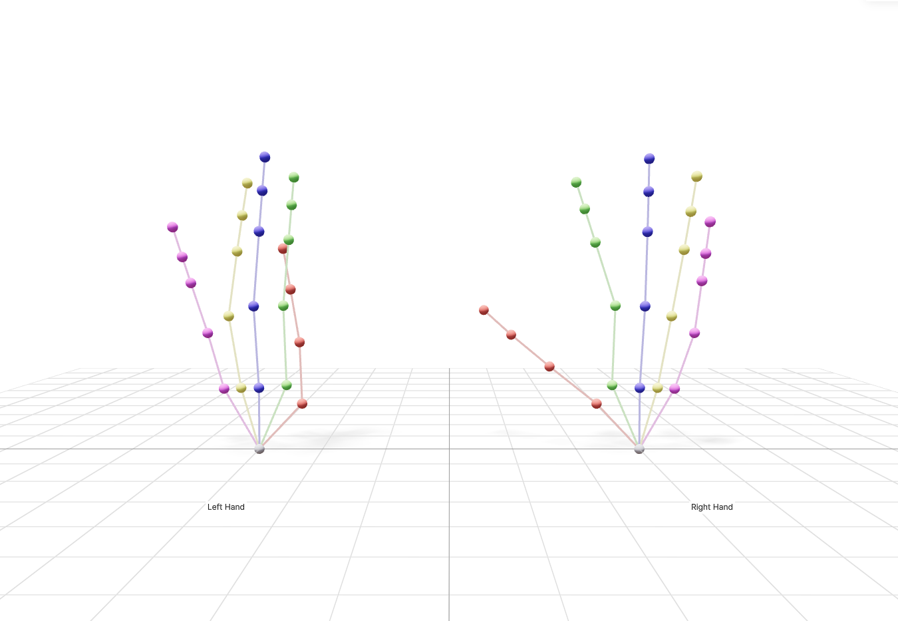

# Manus Glove ZMQ Interface

A ZMQ-based Manus glove server and client. Consists of:

1. **C++ ZMQ server** (`server/`) — reads from ManusSDK and publishes glove data over ZMQ at ~120Hz
2. **Python client** (`manus_glove/`) — subscribes to ZMQ and provides a clean Python API

## Hardware Setup

When connecting the Manus gloves, add the following udev rules:

```bash
sudo tee /etc/udev/rules.d/70-manus-hid.rules << 'EOF'
# HIDAPI/libusb
SUBSYSTEMS=="usb", ATTRS{idVendor}=="3325", MODE:="0666"

# HIDAPI/hidraw
KERNEL=="hidraw*", ATTRS{idVendor}=="3325", MODE:="0666"

SUBSYSTEM=="usb", ATTR{idVendor}=="1915", ATTR{idProduct}=="83fd", MODE="0666", GROUP="plugdev"
EOF

sudo udevadm control --reload-rules && sudo udevadm trigger
```

## Prerequisites

- **ManusSDK** — already included in `ManusSDK/` (headers + `libManusSDK_Integrated.so`)
- **libzmq** — `sudo apt install libzmq3-dev`
- **CMake** >= 3.11
- **Python** >= 3.8

## Building the C++ Server

```bash
cd server
mkdir build && cd build
cmake ..
make -j$(nproc)
```

`nlohmann/json` and `cppzmq` are fetched automatically by CMake.

## Running the Server

```bash
cd server/build
./manus_zmq_server

# Custom ports
./manus_zmq_server --pub-port 5555 --haptic-port 5556
```

The server will:
1. Initialize ManusSDK in integrated mode
2. Search for and connect to a Manus host
3. Publish glove data as JSON over ZMQ PUB on port 5555
4. Listen for haptic commands on port 5556

## Installing the Python Client

```bash
cd manus   # this directory
pip install -e .
```

## Python Usage

```python
from manus_glove import ManusGlove

with ManusGlove(host="localhost") as glove:
    data = glove.get_data("right")
    if data:
        # Fingertip positions {finger_name: np.array([x,y,z])}
        tips = data.get_fingertip_positions()

        # All node positions (N, 3)
        positions = data.get_node_positions()

        # Ergonomics {name: value}
        ergo = data.get_ergonomics_dict()

        # Send haptic feedback
        glove.send_haptic(right_fingers=[0.5, 0.5, 0.0, 0.0, 0.0])
```

### Callback Mode

```python
def on_data(glove_data):
    print(f"{glove_data.side}: {len(glove_data.raw_nodes)} nodes")

with ManusGlove() as glove:
    glove.set_callback(on_data)
    # blocks until Ctrl-C
    import time
    while True:
        time.sleep(1)
```

## ZMQ Message Format

**Topics:** `manus_glove_left`, `manus_glove_right`

Each message is a two-frame ZMQ multipart: `[topic, json_payload]`.

JSON payload structure:
```json
{
    "glove_id": 12345,
    "side": "Right",
    "timestamp": 1234567890.123,
    "raw_nodes": [
        {
            "node_id": 0,
            "parent_node_id": -1,
            "joint_type": "MCP",
            "chain_type": "Hand",
            "position": [0.1, 0.2, 0.3],
            "orientation": [0.0, 0.0, 0.0, 1.0]
        }
    ],
    "ergonomics": [
        {"type": "IndexDIPStretch", "value": 0.5}
    ],
    "raw_sensors": {
        "orientation": [0.0, 0.0, 0.0, 1.0],
        "sensors": [
            {"position": [0.1, 0.2, 0.3], "orientation": [0.0, 0.0, 0.0, 1.0]}
        ]
    }
}
```

## Examples

```bash
# Print live glove data
python examples/print_glove_data.py

# Print fingertip positions only, right hand
python examples/print_glove_data.py --tips --side right

# Print ergonomics at 10Hz
python examples/print_glove_data.py --ergo --hz 10

# Connect to remote machine
python examples/print_glove_data.py --host 192.168.1.100

# Visualize hand keypoints in 3D (opens browser at localhost:8080)
python examples/visualize_hand.py

# Visualize right hand only, custom ports
python examples/visualize_hand.py --side right --host 192.168.1.100 --viser-port 9090
```



## Haptic Feedback

Send haptic commands from Python (5 floats per hand, 0.0–1.0):

```python
glove.send_haptic(
    left_fingers=[0.5, 0.5, 0.0, 0.0, 0.0],   # thumb, index, middle, ring, pinky
    right_fingers=[0.0, 0.0, 0.5, 0.5, 0.5],
)
```

The server forwards these to `CoreSdk_VibrateFingersForGlove`.
# manus_zmq_python
